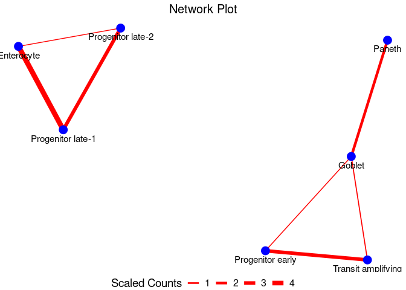

<!-- README.md is generated from README.Rmd. Please edit that file -->

# ULM

<!-- badges: start -->
<!-- badges: end -->

An R package for the prediction and identification of multiplets from
scRNAseq datasets to infer physical cell-cell interaction networks.
Multiplets occur naturally in conventional scRNAseq due to incomplete
dissociation during library preparation. They represent cells which are
physically connected and interacting in tissues which become sequenced
together as they remain unseperated. ULM utilizes a signature-based
approach where univariate linear models are fitted over each barcode in
a scRNAseq data to assign signature scores. Barcodes are then classified
as singlets or multiplets based on their signature scores. Multiplets
are those barcodes or cells that are enriched in two or more cell
type-specific gene signatures.


## Installation

You can install the development version of ULM from
[GitHub](https://github.com/) with:

``` r
if (!requireNamespace("devtools", quietly = TRUE)) {
  install.packages("devtools")
}
library(devtools)

#devtools::install_github("Sidex71/ULM")
```

## Example

This is a quick example which shows how to infer physical cell-cell
interaction network from a scRNAseq data:

``` r
library(ULM)
data("int_singData")  ##int_singData is a seurat object with a Cell_Type column containing cell annotations.
set.seed(101324)
int_sig <- ULM::GetSignature(int_singData, ident_col = int_singData$Cell_Type, n = 100)
#> using the specified seurat ident to generate signatures
#> Calculating cluster Progenitor early
#> Calculating cluster Progenitor late-1
#> Calculating cluster Transit amplifying
#> Calculating cluster Progenitor late-2
#> Calculating cluster Goblet
#> Calculating cluster Stem
#> Calculating cluster Enterocyte
#> Calculating cluster Paneth
#> Calculating cluster Enteroendocrine
#> Calculating cluster Tuft
my_scores <- GetCellScores(seurat_obj = int_singData, signatures = int_sig, assay = 'RNA', slot = 'data')
my_assign <- GetCellAssignments(score_data = my_scores, cut_off = 1, p_val = 0.05)
int_singData <- AddMetaObject(int_singData, cell_class_df = my_assign)
my_mult_filt <- FilterMultiplet(int_singData, minCells = 2, minFreq = 10)
#> Warning: Removing 1929 cells missing data for vars requested
multSummaryFilt <- my_mult_filt$multSummaryFilt
my_node_df <- GetNodeDF(mat = multSummaryFilt)
PlotNetwork(my_node_df)
```



What is special about using `README.Rmd` instead of just `README.md`?
You can include R chunks like so:

``` r
summary(cars)
#>      speed           dist       
#>  Min.   : 4.0   Min.   :  2.00  
#>  1st Qu.:12.0   1st Qu.: 26.00  
#>  Median :15.0   Median : 36.00  
#>  Mean   :15.4   Mean   : 42.98  
#>  3rd Qu.:19.0   3rd Qu.: 56.00  
#>  Max.   :25.0   Max.   :120.00
```

You’ll still need to render `README.Rmd` regularly, to keep `README.md`
up-to-date. `devtools::build_readme()` is handy for this.

You can also embed plots, for example:


In that case, don’t forget to commit and push the resulting figure
files, so they display on GitHub and CRAN.
